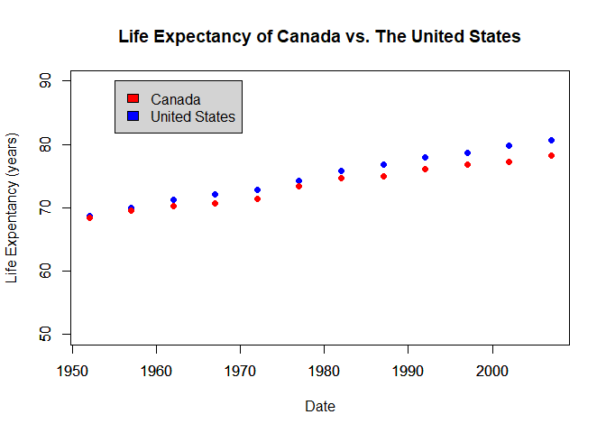

In the file, we're going try playing around with a couple of datasets. We'll start with Gapminder like we did in class, and then move onto some of the built-in datasets in R that are available to us.

## Let's Get Started - Gapminder

We're going to start with the Gapminder data frame to try out some R functions.


```r
head(gapminder)
```

```
## # A tibble: 6 x 6
##   country     continent  year lifeExp      pop gdpPercap
##   <fct>       <fct>     <int>   <dbl>    <int>     <dbl>
## 1 Afghanistan Asia       1952    28.8  8425333      779.
## 2 Afghanistan Asia       1957    30.3  9240934      821.
## 3 Afghanistan Asia       1962    32.0 10267083      853.
## 4 Afghanistan Asia       1967    34.0 11537966      836.
## 5 Afghanistan Asia       1972    36.1 13079460      740.
## 6 Afghanistan Asia       1977    38.4 14880372      786.
```

So it looks like we have a bunch of data on some countries. Let's see if we have anything on our favorite countries, Canada and the US, using the `any()` function.


```r
any(gapminder=="Canada")
```

```
## [1] TRUE
```

```r
any(gapminder=="United States")
```

```
## [1] TRUE
```

Great, now lets compare the two in a nice plot.

<!-- -->

Well, I was hoping Canada would do better than the States in this category but I guess not. Let's move on, shall we?

## Built-in Datasets

There's plenty of built-in datasets meant just for this purpose - getting used to R. 
Because I found out how to do it on the internet, let's plot the surface graph of a volcano! (Try clicking and dragging)

### Well, I hope this is enough for a reasonable grade. Thanks for your time!
